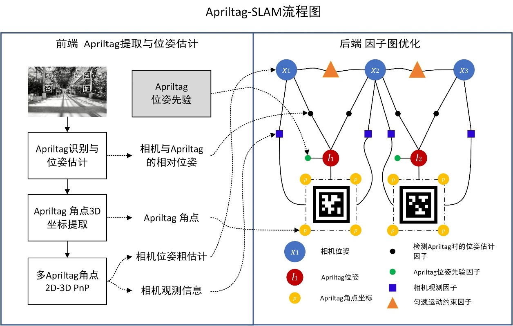
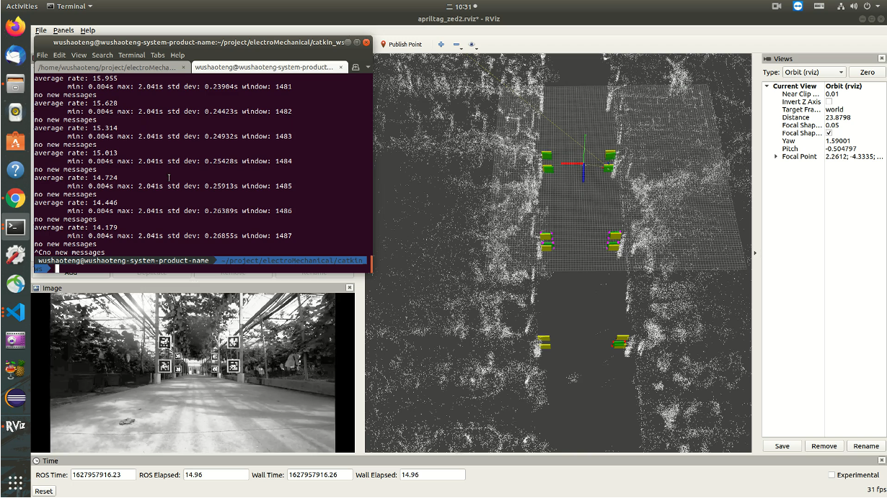

# AprilSLAM - Mapping and localization from AprilTags

## 1. Introduction

Some basic code in this repository is forked from https://github.com/ProjectArtemis/aprilslam . Thanks [*@mhkabir*](https://github.com/mhkabir) for opening the awesome code.

AprilSLAM is a package designed for fast camera pose estimation from a single or multiple AprilTags(link) in an unstructured environment. AprilSLAM needs prior information of Apriltags for better localization performance. The system can map multiple tags in the camera's view as long as there is atleast another tag in view to estimate relative tag pose the first time. The system has been run with a forward looking ZED2 stereo camera on an AGV with an X86-based computing solutions for precise estimation of the vehicle pose. The localization FPS is nearly 30Hz. The system is implemented under ROS (Robot Operating System) for ease of integration, but should be easy to run without it as well.



We use the awesome AprilTag implementation of M. Kaess for tag extraction [1,2]. GTSAM [3] is used for the mapping system.

The default AprilTag family used is 36h11 with a black border of 1. A PDF of the tag family is available here : http://www.dotproduct3d.com/assets/pdf/apriltags.pdf

Package originally developed by Chao Qu and Gareth Cross from Kumar Robotics (www.kumarrobotics.org) and M.H.Kabirm. The repository is forked from the original Apriltag SLAM and is developed and maintained by Shaoteng Wu from SJTU. (Contact me: wushaoteng@sjtu.edu.cn)



## 2. Dependencies

The code is implemented majorly based on [ROS melodic](https://www.ros.org/), [GTSAM 4.0.2](https://github.com/borglab/gtsam) and [OpenCV 4.4.0](https://opencv.org/opencv-4-0/).

### 2.1 GTSAM 4.0.2

GTSAM [installation](https://github.com/borglab/gtsam)
```
#!bash
$ git clone https://github.com/borglab/gtsam.git
$ cd gtsam
$ mkdir build
$ cd build
$ cmake ..
$ make check (optional, runs unit tests)
$ sudo make install
```

### 2.2 OpenCV 4.4.0

You can install OpenCV 4.4.0 refer to this [link](https://gist.github.com/raulqf/f42c718a658cddc16f9df07ecc627be7). CUDA is not necessarily needed and you can customize your own compilation settings. Aprilslam only need some basic data structures and algorithms.

### 2.3 Apriltag ROS
```
#!bash
$ sudo apt-get install ros-melodic-apriltag
```


## 3. Get Started

### 3.1 Build

```
#!bash
$ cd YOUR_WORK_SPACE/src
$ git clone https://github.com/ShaotengWu/aprilslam.git 
$ cd ..
$ catkin build
```

### 3.2 Get test data

You can get example data on Baidu Netdisk with following link and password.

Link:     https://pan.baidu.com/s/1kbAQ4fmSu9N7nlXAXFHemw
Password: sbs4

### 3.3 Modify Parameters

In `aprilslam/aprilslam/launch/slam.launch`, set proper value of following parameters according to your settings.
**Attention:** The prior information yaml should be consistent with bag data for better localization performance.
```xml
<arg name="camera" default="/zed2_left" />
<arg name="use_tag_prior_info" default="true" />
<arg name="tag_prior_info_path" default="$(find aprilslam)/config/YOUR_CONFIG.yaml" />
...
<node pkg="rosbag" type="play" name="bag_data" args="--clock  PATH_TO_YOUR_BAG_DATA.bag" />
```

### 3.4 Launch
```bash
$ catkin build
$ source devel/setup.bash
# if you use zsh:
# $ source devel/setup.zsh
$ roslaunch aprilslam slam.launch
```


## 4.References

Please cite the appropriate papers when using this package or parts of it in an academic publication.

    1. Edwin Olson (2011). AprilTag: A robust and flexible visual fiducial system. Proceedings of the IEEE International Conference on Robotics and Automation (ICRA), pp. 3400–3407
    2. Michael Kaess. http://people.csail.mit.edu/kaess/apriltags/, Nov. 2013
    3. GTSAM. https://collab.cc.gatech.edu/borg/gtsam/
